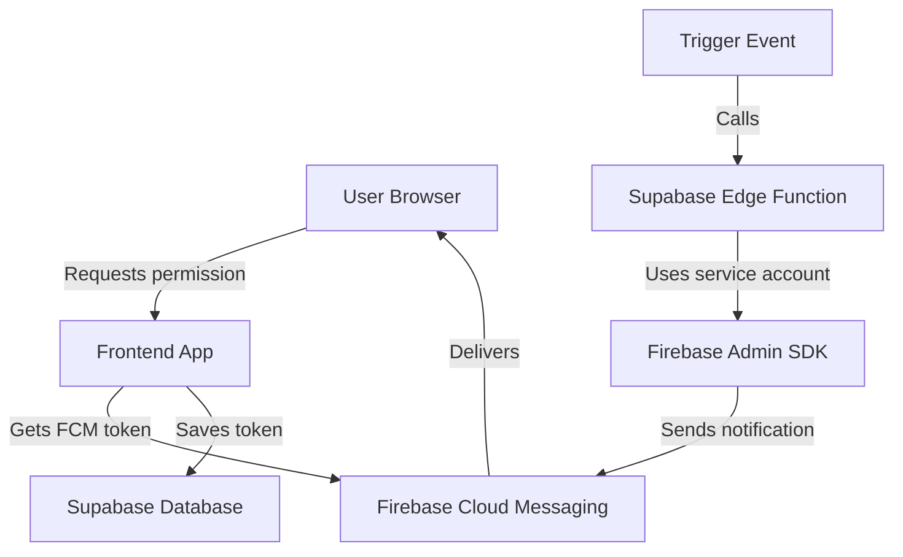

# Firebase Security Best Practices

## ⚠️ CRITICAL SECURITY INFORMATION

### Service Account Keys

The Firebase service account key contains **extremely sensitive** credentials that provide full admin access to your Firebase project.

**NEVER:**
- ❌ Commit service account keys to Git
- ❌ Share them publicly
- ❌ Store them in client-side code
- ❌ Include them in your frontend bundle
- ❌ Post them in forums, issues, or documentation

**ALWAYS:**
- ✅ Store them in secure environment variables
- ✅ Use them only on server-side (Edge Functions, backend)
- ✅ Rotate keys regularly
- ✅ Revoke compromised keys immediately
- ✅ Use `.gitignore` to exclude them from version control

## Secure Implementation Architecture

### 1. Client-Side (Frontend)
The frontend should only use:
- Public Firebase config (API key, project ID, etc.)
- VAPID key for web push
- These are safe to expose as they're restricted by security rules

### 2. Server-Side (Edge Functions)
The backend/Edge Functions should use:
- Service account credentials
- Stored in environment variables or secret management
- Never exposed to client

## Setting Up Secure Environment Variables

### For Supabase Edge Functions

1. **Store service account in Supabase Vault:**
```bash
# Do NOT run this with the actual key visible!
# Store each part as a separate secret
supabase secrets set FIREBASE_PROJECT_ID="vhdata-platform"
supabase secrets set FIREBASE_PRIVATE_KEY_ID="your_private_key_id"
supabase secrets set FIREBASE_PRIVATE_KEY="your_private_key"
supabase secrets set FIREBASE_CLIENT_EMAIL="firebase-adminsdk-fbsvc@vhdata-platform.iam.gserviceaccount.com"
supabase secrets set FIREBASE_CLIENT_ID="your_client_id"
```

2. **Deploy the Edge Function:**
```bash
supabase functions deploy send-push-notification
```

### For Local Development

Create a `.env.local` file (never commit this!):
```env
# Client-side variables (safe to expose)
VITE_FIREBASE_API_KEY=your_api_key
VITE_FIREBASE_AUTH_DOMAIN=vhdata-platform.firebaseapp.com
VITE_FIREBASE_PROJECT_ID=vhdata-platform
VITE_FIREBASE_STORAGE_BUCKET=vhdata-platform.appspot.com
VITE_FIREBASE_MESSAGING_SENDER_ID=643537450221
VITE_FIREBASE_APP_ID=1:643537450221:web:e9dc337c7d5f97400188e4
VITE_FIREBASE_VAPID_KEY=your_vapid_key

# Server-side variables (NEVER expose to client!)
# These should only be used in Edge Functions or backend
FIREBASE_SERVICE_ACCOUNT_PATH=./service-account.json  # For local dev only
```

## Implementation Flow



## Security Checklist

Before deploying to production:

- [ ] Service account key is NOT in any code files
- [ ] Service account key is NOT in Git history
- [ ] `.gitignore` includes all credential patterns
- [ ] Environment variables are properly configured
- [ ] Edge Function uses secure environment variables
- [ ] Client-side code only uses public config
- [ ] API endpoints are authenticated
- [ ] Rate limiting is implemented
- [ ] Notification preferences are enforced
- [ ] Tokens are cleaned up periodically

## If Credentials Are Compromised

1. **Immediately revoke the service account key:**
   - Go to [Firebase Console → Project Settings → Service Accounts](https://console.firebase.google.com/project/vhdata-platform/settings/serviceaccounts/adminsdk)
   - Delete the compromised key
   - Generate a new one

2. **Rotate all secrets:**
   ```bash
   supabase secrets unset FIREBASE_PRIVATE_KEY_ID
   supabase secrets unset FIREBASE_PRIVATE_KEY
   # Set new values
   ```

3. **Audit access logs:**
   - Check Firebase Console for unusual activity
   - Review Supabase logs

4. **Update all deployments:**
   - Update Edge Functions
   - Redeploy applications
   - Clear caches

## Alternative: Using Supabase for Notifications

If security is a major concern, consider using Supabase's built-in notification system instead of Firebase:

1. **Supabase Realtime:** For in-app notifications
2. **Supabase Auth:** For email notifications
3. **Third-party services:** Like SendGrid, Twilio for other channels

These integrate natively with Supabase and don't require managing additional service accounts.

## Resources

- [Firebase Admin SDK Security](https://firebase.google.com/docs/admin/setup#security)
- [Supabase Secrets Management](https://supabase.com/docs/guides/functions/secrets)
- [Web Push Security Best Practices](https://web.dev/push-notifications-permissions-ux/)
- [OWASP API Security](https://owasp.org/www-project-api-security/)