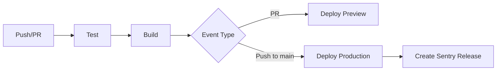

# 🧪 Testing & CI/CD Guide

## Тестирование

### Установленные инструменты

- **Vitest** - быстрый unit test runner (совместим с Jest API)
- **@testing-library/react** - тестирование React компонентов
- **@testing-library/jest-dom** - дополнительные matchers
- **@testing-library/user-event** - симуляция пользовательских событий
- **jsdom** - DOM окружение для тестов
- **@vitest/ui** - UI для просмотра тестов

### Конфигурация

**`vitest.config.ts`** - конфигурация Vitest
**`src/test/setup.ts`** - setup файл с глобальными настройками

### Команды тестирования

```bash
# Запуск тестов в watch режиме
npm test

# Запуск тестов один раз
npm run test:run

# Запуск с UI
npm run test:ui

# Генерация coverage отчета
npm run test:coverage
```

### Структура тестов

```
src/
├── utils/
│   ├── __tests__/
│   │   └── parseData.test.ts
│   └── parseData.ts
├── components/
│   ├── common/
│   │   ├── __tests__/
│   │   │   └── LoadingSpinner.test.tsx
│   │   └── LoadingSpinner.tsx
│   └── ui/
│       ├── __tests__/
│       │   └── button.test.tsx
│       └── button.tsx
└── test/
    └── setup.ts
```

### Примеры тестов

#### Unit тест для utility функции

```typescript
// src/utils/__tests__/parseData.test.ts
import { describe, it, expect } from 'vitest';
import { formatAmount } from '../parseData';

describe('formatAmount', () => {
  it('должен форматировать числа с разделителями тысяч', () => {
    expect(formatAmount(1000)).toBe('1,000');
    expect(formatAmount(1000000)).toBe('1,000,000');
  });
});
```

#### Component тест

```typescript
// src/components/ui/__tests__/button.test.tsx
import { describe, it, expect } from 'vitest';
import { render, screen } from '@testing-library/react';
import { Button } from '../button';

describe('Button', () => {
  it('должен рендериться с текстом', () => {
    render(<Button>Click me</Button>);
    expect(screen.getByRole('button')).toBeDefined();
  });
});
```

### Best Practices

1. **Naming Convention**
   - Файлы тестов: `ComponentName.test.tsx` или `functionName.test.ts`
   - Папки: `__tests__/` рядом с тестируемым кодом

2. **Test Structure**
   - Используйте `describe` для группировки
   - Используйте `it` или `test` для отдельных тестов
   - Следуйте паттерну Arrange-Act-Assert

3. **Мокирование**

   ```typescript
   import { vi } from 'vitest';
   
   // Мокирование функции
   const mockFn = vi.fn();
   
   // Мокирование модуля
   vi.mock('@/lib/sentry', () => ({
     captureException: vi.fn(),
   }));
   ```

4. **Coverage Goals**
   - Utils/helpers: 80%+ coverage
   - Components: 60%+ coverage
   - Integration tests: key user flows

---

## CI/CD Pipeline

### GitHub Actions Workflow

**Файл:** `.github/workflows/ci.yml`

### Jobs Overview



### 1. Test Job

Запускается на каждом push и PR:

```yaml
steps:
  - Checkout code
  - Setup Node.js 20
  - Install dependencies
  - Run linter
  - Run tests
  - Generate coverage
  - Upload to Codecov
```

**Что проверяется:**

- ✅ Lint errors
- ✅ Unit tests pass
- ✅ Code coverage

### 2. Build Job

Выполняется после успешных тестов:

```yaml
steps:
  - Checkout code
  - Setup Node.js
  - Install dependencies
  - Build application
  - Check bundle size
  - Upload artifacts
```

**Environment Variables:**

- `VITE_SUPABASE_URL`
- `VITE_SUPABASE_PUBLISHABLE_KEY`
- `VITE_SUPABASE_PROJECT_ID`

### 3. Deploy Preview (PR only)

Деплой preview версии для PR:

```yaml
steps:
  - Download build artifacts
  - Deploy to Vercel Preview
```

### 4. Deploy Production (main branch only)

Деплой в production при push в main:

```yaml
steps:
  - Download build artifacts
  - Deploy to Vercel Production
  - Create Sentry release
```

---

## GitHub Secrets Configuration

### Обязательные Secrets

Добавьте в **Settings → Secrets and variables → Actions**:

#### Supabase

```
VITE_SUPABASE_URL=https://your-project.supabase.co
VITE_SUPABASE_PUBLISHABLE_KEY=your_anon_key
VITE_SUPABASE_PROJECT_ID=your_project_id
```

#### Vercel (для деплоя)

```
VERCEL_TOKEN=your_vercel_token
VERCEL_ORG_ID=your_org_id
VERCEL_PROJECT_ID=your_project_id
```

#### Codecov (опционально)

```
CODECOV_TOKEN=your_codecov_token
```

#### Sentry (опционально)

```
VITE_SENTRY_DSN=your_sentry_dsn
SENTRY_AUTH_TOKEN=your_sentry_auth_token
SENTRY_ORG=your_org
SENTRY_PROJECT=your_project
```

### Получение Vercel Credentials

```bash
# 1. Установите Vercel CLI
npm i -g vercel

# 2. Залогиньтесь
vercel login

# 3. Линкуйте проект
vercel link

# 4. Получите org и project ID
cat .vercel/project.json
```

---

## Workflow Triggers

### Автоматический запуск

- ✅ Push в `main` или `develop`
- ✅ Pull Request в `main` или `develop`

### Что происходит

| Event              | Test | Build | Preview | Production | Sentry |
|--------------------|------|-------|---------|------------|--------|
| PR to main/develop | ✅   | ✅    | ✅      | ❌         | ❌     |
| Push to develop    | ✅   | ✅    | ❌      | ❌         | ❌     |
| Push to main       | ✅   | ✅    | ❌      | ✅         | ✅     |

---

## Branch Strategy

### Рекомендуемая стратегия

```
main (production)
  ↑
  PR
  ↑
develop (staging)
  ↑
  PR
  ↑
feature/your-feature
```

### Workflow

1. **Feature Development**

   ```bash
   git checkout -b feature/new-feature develop
   # Разработка
   git push origin feature/new-feature
   ```

2. **Pull Request**
   - Создайте PR в `develop`
   - CI запустится автоматически
   - Preview deployment создастся

3. **Merge to Develop**
   - После ревью и прохождения CI
   - Автоматический build

4. **Release to Production**
   - PR из `develop` в `main`
   - После merge - автоматический deploy
   - Sentry release создается

---

## Мониторинг

### Проверка статуса CI

GitHub Actions tab:

```
https://github.com/your-username/your-repo/actions
```

### Coverage Reports

Codecov dashboard (если настроен):

```
https://codecov.io/gh/your-username/your-repo
```

### Bundle Size Monitoring

Проверяется автоматически в Build job:

- Output в Actions logs
- Можно добавить bundlesize для fail при превышении лимита

---

## Local Development

### Pre-commit Checklist

```bash
# 1. Запустите тесты
npm test

# 2. Проверьте линтинг
npm run lint

# 3. Соберите проект
npm run build

# 4. Проверьте coverage
npm run test:coverage
```

### Pre-push Hook (optional)

Создайте `.husky/pre-push`:

```bash
#!/bin/sh
. "$(dirname "$0")/_/husky.sh"

npm run test:run
npm run lint
```

---

## Troubleshooting

### Tests Failing Locally

```bash
# Очистите кэш
npm run test -- --clearCache

# Запустите в UI режиме для дебага
npm run test:ui
```

### CI Failing But Local Passing

1. Проверьте Node версию (должна быть 20)
2. Убедитесь что используете `npm ci` а не `npm install`
3. Проверьте environment variables

### Build Failing

1. Проверьте что все secrets настроены
2. Проверьте console в GitHub Actions
3. Тестируйте локально с теми же env vars

### Deploy Failing

1. Проверьте Vercel credentials
2. Убедитесь что проект правильно связан
3. Проверьте логи в Vercel dashboard

---

## Расширение CI/CD

### Добавление E2E тестов

```yaml
e2e-tests:
  runs-on: ubuntu-latest
  needs: build
  steps:
    - uses: actions/checkout@v4
    - uses: cypress-io/github-action@v6
      with:
        start: npm run preview
        wait-on: 'http://localhost:4173'
```

### Добавление Lighthouse CI

```yaml
lighthouse:
  runs-on: ubuntu-latest
  needs: deploy-preview
  steps:
    - uses: treosh/lighthouse-ci-action@v10
      with:
        urls: ${{ env.PREVIEW_URL }}
        uploadArtifacts: true
```

### Добавление Security Scan

```yaml
security:
  runs-on: ubuntu-latest
  steps:
    - uses: actions/checkout@v4
    - name: Run Snyk
      uses: snyk/actions/node@master
      env:
        SNYK_TOKEN: ${{ secrets.SNYK_TOKEN }}
```

---

## Метрики & Мониторинг

### Отслеживайте

1. **Test Coverage** - стремитесь к 70%+
2. **Build Time** - оптимизируйте если >5 минут
3. **Bundle Size** - алертируйте при росте >10%
4. **Deploy Frequency** - цель: несколько раз в неделю
5. **Failed Deployments** - цель: <5%

---

## Заключение

✅ **Настроено:**

- Unit testing с Vitest
- Component testing с Testing Library
- Автоматические тесты в CI
- Lint проверки
- Automated builds
- Preview deployments для PR
- Production deployments
- Sentry release tracking
- Coverage reporting

**Следующие шаги:**

1. Настройте GitHub Secrets
2. Сделайте первый PR для тестирования pipeline
3. Настройте branch protection rules
4. Добавьте badge статуса CI в README
5. Настройте уведомления о failed builds

---

*Документ обновлен: 15.10.2025*
